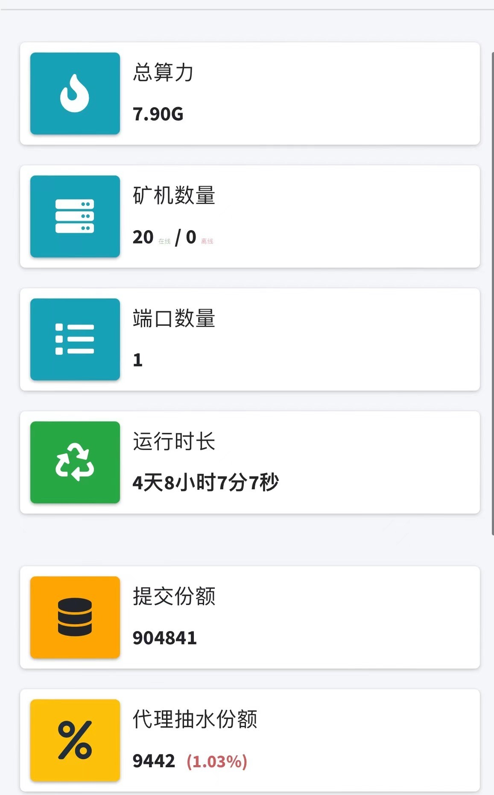
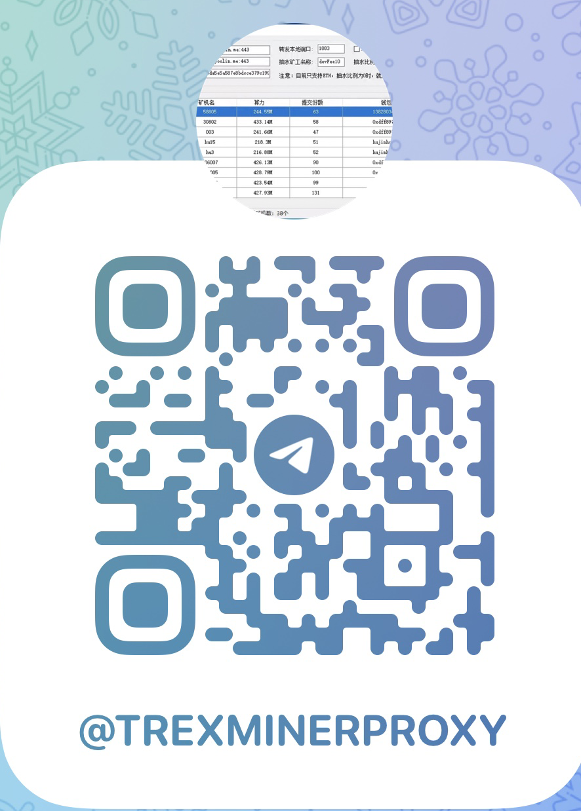

# minerProxy
已内置ssl证书，可以自定义ssl证书,在程序目录下放入server.key和server.pem文件即可；

开发费恒定千三！无论你抽3%还是30%，甚至80%，都是0.3%开发费；抽水比例最高可设置99%！
支持ETC转发！

交流电报群https://t.me/trexminerproxy


# windows版本下载:
[点击下载 ](https://github.com/ethminerpro/minerproxy/raw/main/ethminerproxy_windows.exe) 。
## 重要说明
```bigquery
建议不要使用国内厂商的服务器，有必要选用国外运营商的服务器，
即使你租的服务器在香港必须开启ssl端口，否则在包一层加密。
开发者抽水0.3%,目前运行最稳定的软件之一
国外香港云服务器推荐，小厂商服务器不稳定谨慎使用

阿里云国际：
https://au.alibabacloud.com
loc vps：
https://www.locvps.com/


任何问题请加TG群：
https://t.me/trexminerproxy

